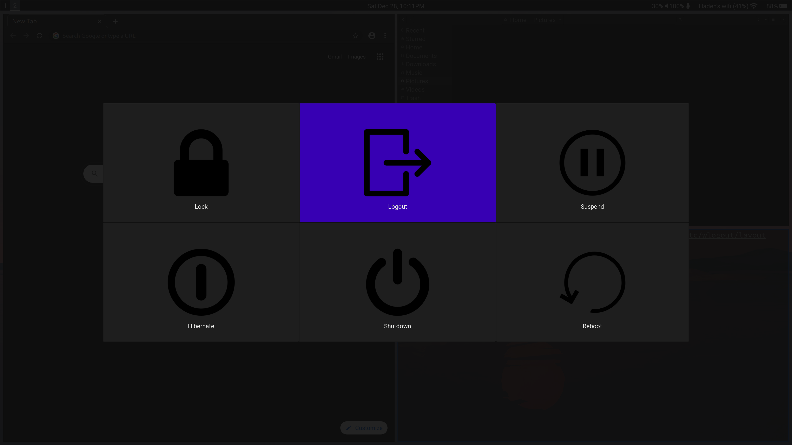

# wlogout

> wlogout is a logout menu for [wayland](https://wayland.freedesktop.org/) environments.

<a href="https://repology.org/project/wlogout/versions">
    
</a>

## Running
Run `wlogout` to launch and press `Escape` to exit.
## Config
If you are editing the default layout and CSS file, it is recommended that you copy `/etc/wlogout/layout` and `/etc/wlogout/style.css` to `~/.config/wlogout/` and change them there.
### Layout
Custom buttons can be defined and edited in a layout file. The format is as follows:
```
{
    "label" : "CSS Label",
    "action" : "command to execute when clicked",
    "text" : "text displayed on button",
    "keybind" : "character to be bound"
}
```
Check the default [layout file](layout) for examples, and run `man 5 wlogout` for documentation.
### Style
wlogout can be easily styled through the style.css file. If you would like to style a button, use the label given to it in the layout file, and for other styling, refer to the [GTK Manual](https://developer.gnome.org/gtk3/stable/chap-css-properties.html), which shows all the allowed CSS.
## Install
### Archlinux
Arch users can use [wlogout](https://aur.archlinux.org/packages/wlogout/).
```
yay -S wlogout
```
### Other Distros
Install "wlogout" with your distro's package manager.
### Compiling from Source
Install dependencies:
* GTK+
* GObject introspection
* meson
* gtk-layer-shell (optional: transperancy)
* scdoc (optional: man pages)
* systemd (optional: default buttons)

Run these commands:
```
git clone https://github.com/ArtsyMacaw/wlogout.git
cd wlogout
meson build
ninja -C build
sudo ninja -C build install
```
## License
wlogout is licensed under MIT. [Refer to LICENSE for more information](LICENSE)
